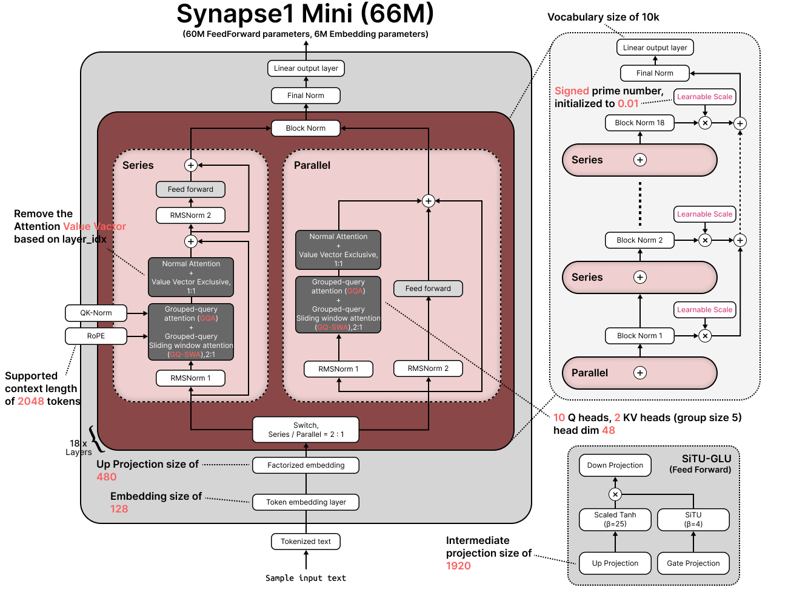

# Synapse1 Mini

Synapse1 Mini는 2021년부터 기획되었고, 2022년부터 개발을 시작한 개인 연구 프로젝트로, 언어의 인과적 관계를 학습하는 Causal Language Model(CLM)을 직접 설계하고 구현하는 것을 목표로 합니다.

오랜 기간 개인 컴퓨터에서 개발해 온 프로젝트의 연구 과적과 결과물을 정리하여 Github에 2026년부터 공개하고 있습니다.

## Overview

Synapse1 Mini는 기존 Transformer 구조를 그대로 사용하는 것에 그치지 않고, 작은 언어 모델에서도 효율적인 학습과 추론이 가능하도록 **모델 아키텍처 자체를 연구하고 설계하는 것**을 주요 목표로 합니다.

이 저장소에는 Syanpse1 프로젝트에서 연구한 모델 구조와 학습 코드, 실험 결과 및 관련 자료가 단계적으로 추가될 예정입니다.

## Architecture

현재 공개된 Synapse1 Mini의 아키텍처는 다음과 같습니다.

본 아키텍처 다이어그램은 Sebastian Raschka의 [LLM Architecture Gallery](https://sebastianraschka.com/llm-architecture-gallery/)의 시각적 표현 방식을 참고하여 Synapse1 프로젝트를 위해 새롭게 제작되었습니다. 원본 이미지를 복제한 것이 아닙니다.
Reference: 
- [Sebastian Rsachka](https://sebastianraschka.com)
- [LLM Architecture Gallery](https://sebastianraschka.com/llm-architecture-gallery)

## Project Status

현재 프로젝트는 개발 및 실험이 진행 중입니다.

| 항목 | 상태 |
|---|---|
| Architecture design | 진행 중 |
| Architecture diagram | 완료 (변경사항 적용) |
| Model implementation | 진행 중 |
| Training | 진행 중 |
| Evaluation | 예정 |
| Pretrained Weights | 예정 |
| Documentation | 진행 중 |

저장소에 공개되는 내용은 개발 과정에 따라 순차적으로 추가될 예정입니다.

## License

라이선스 및 각 파일의 사용 조건은 프로젝트의 코드, 모델 가중치, 문서 및 기타 자료의 특성에 따라 별도로 명시할 예정입니다.

## Citation

Synapse1 Mini의 아키텍처 또는 연구 내용을 참고하거나 이를 기반으로 연구를 진행하는 경우, 해당 프로젝트를 인용해주세요.

#### 잡담

초등학생 때부터 기획과 동시에 코딩을 배우며, 중학생 때엔 Transformer와 PyTorch를 공부하고, 고등학생이 된 지금 모델을 구현하는 데까지 이르렀습니다.

한 문장으로 압축하기 힘들 정도로 하루 5시간 이상씩 AI와 코딩을 공부하며 새로운 기법들과 논문들, 영상을 찾아보며 지금의 모델을 만들어온 것이 매우 기쁩니다.

여태 컴퓨터에 쌓인 모델 파일들과 수많은 Pretrained 모델들, 그리고 성공과 실패를 보며 혼자만의 시간에 빠져있다가 지금에서야 GitHub를 사용하여 차근히 공개합니다.

아직 AI는 계속 발전하고, 개발 환경이 부족하여 완벽한 sLM을 만들지는 못했지만, 계속 발전하여 언젠가 완벽에 가까운 sLM을 만들도록 노력하겠습니다.